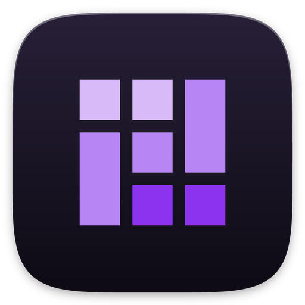
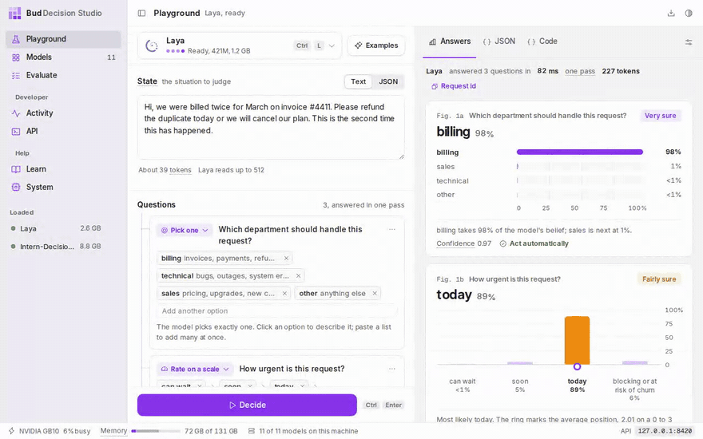
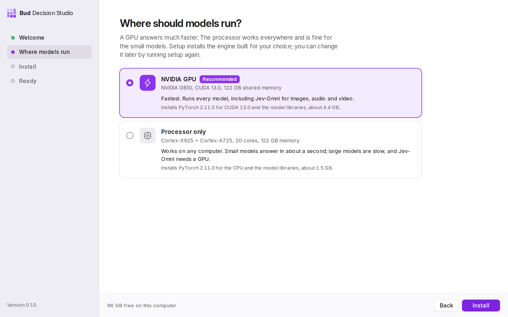
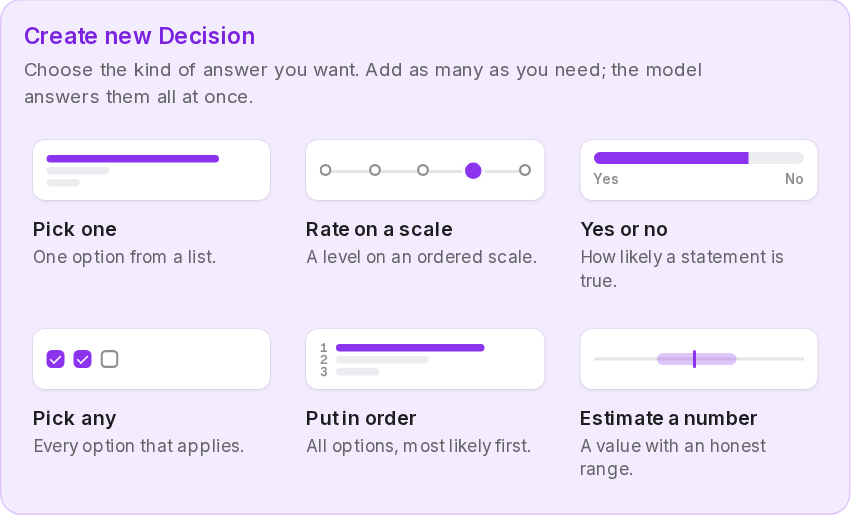
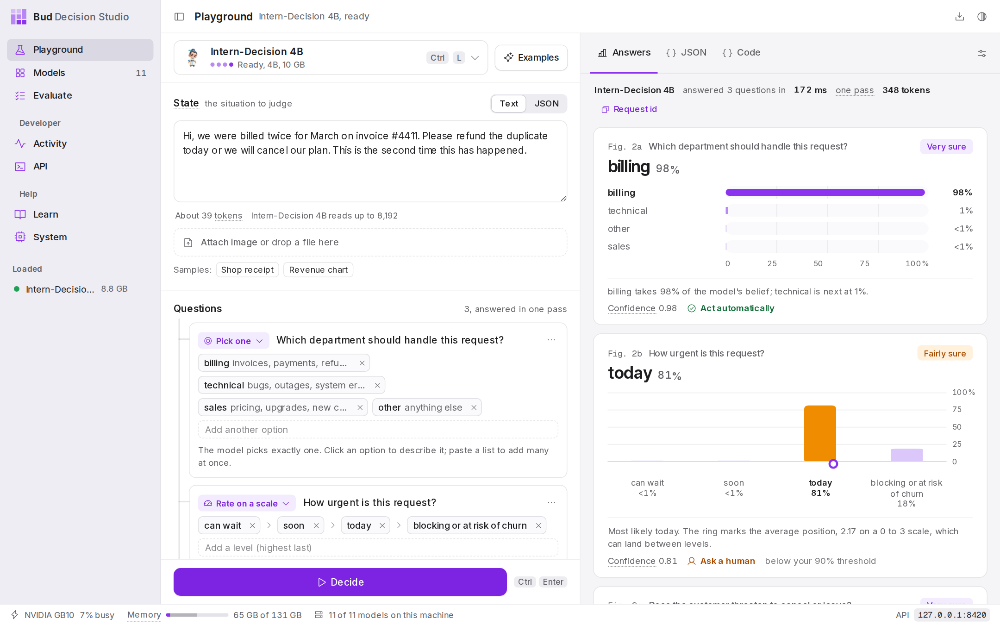
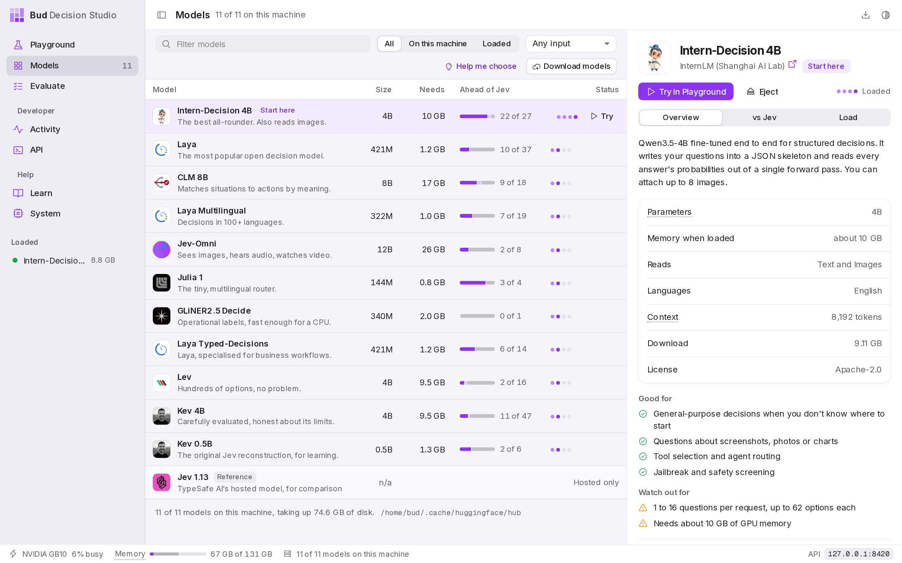
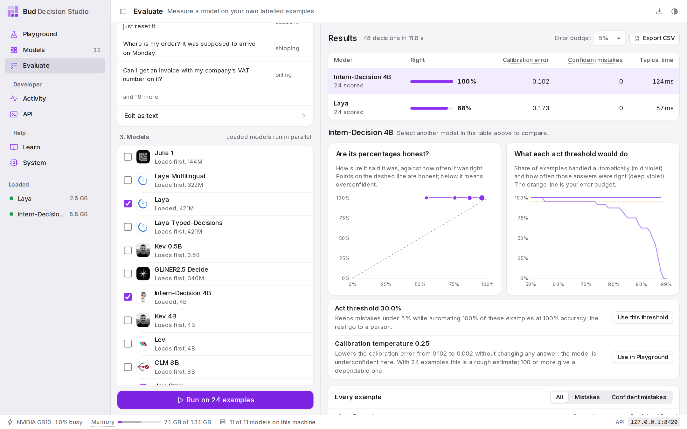
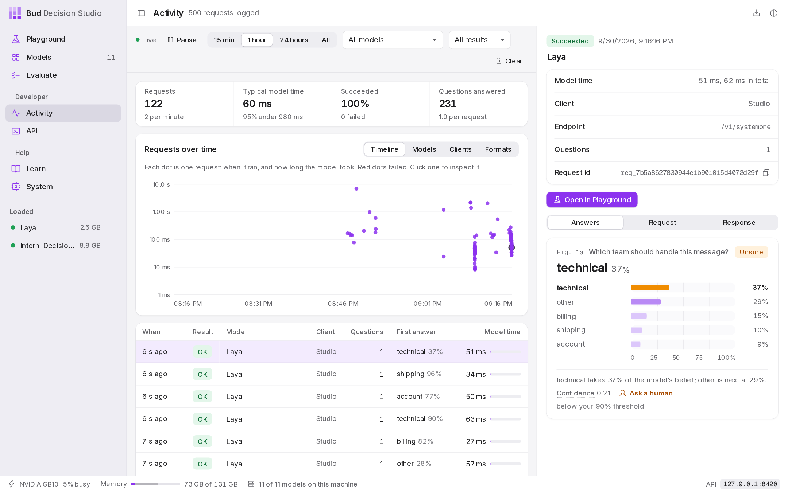
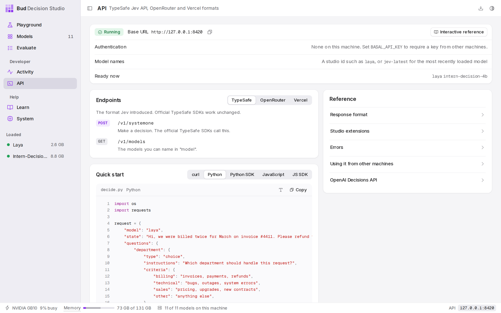
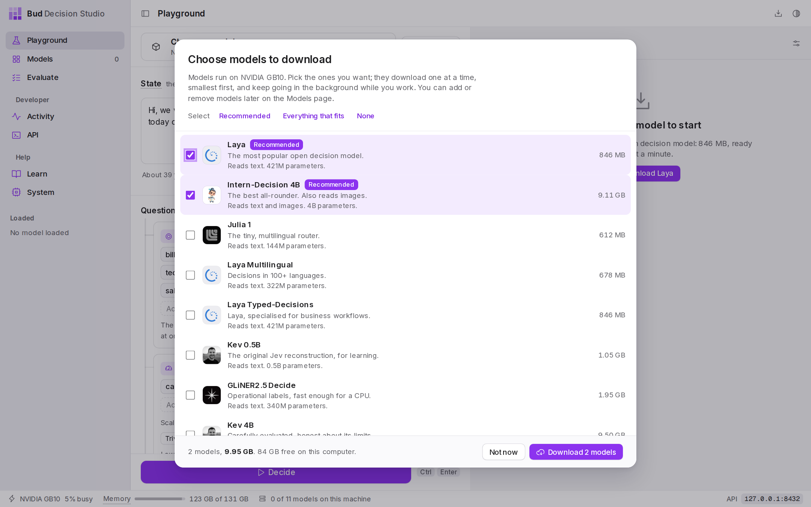

<p align="center">
  
</p>

<h1 align="center">Bud Decision Studio</h1>

<p align="center">
  <b>Run open decision models on your own computer.</b><br>
  Give a model a situation and a few questions; get a calibrated probability for every answer, in milliseconds.<br>
  The LM Studio of Jev-like "System One" models, from <a href="https://github.com/BudEcosystem">Bud Ecosystem</a>.
</p>

<p align="center">
  <a href="https://github.com/BudEcosystem/Bud-Decision-Engine/releases/latest"></a>
  
  
  
</p>

<p align="center">
  
</p>

## Install

**One line**, and the app opens when it is done:

| System | Command |
|---|---|
| macOS (Apple Silicon) and Linux | `curl -fsSL https://raw.githubusercontent.com/BudEcosystem/Bud-Decision-Engine/main/get.sh \| sh` |
| Windows (PowerShell) | `irm https://raw.githubusercontent.com/BudEcosystem/Bud-Decision-Engine/main/get.ps1 \| iex` |

**Or download** from the [latest release](https://github.com/BudEcosystem/Bud-Decision-Engine/releases/latest):

| Your computer | Download | Then |
|---|---|---|
| Mac with Apple Silicon (M1 or newer) | `…_aarch64.dmg` | Open it and drag the app to Applications |
| Windows 10 or 11 | `…_x64-setup.exe` (or `.msi`) | Run it; the app is added to the Start menu |
| Ubuntu or Debian | `…_amd64.deb` / `…_arm64.deb` | `sudo apt install ./Bud*.deb` |
| Fedora or openSUSE | `…x86_64.rpm` / `…aarch64.rpm` | `sudo dnf install ./Bud*.rpm` |
| Any other Linux | `…AppImage` | `chmod +x Bud*.AppImage` and open it; it adds itself to your applications menu |

NVIDIA GB10 (DGX Spark) and other ARM64 Linux computers use the `arm64` / `aarch64` files.

### What happens the first time

<p align="center"></p>

1. **It checks your computer**: graphics, processor, memory and free disk.
2. **It asks where models should run**: the GPU (recommended when there is one) or the processor. Each choice says what it installs and how big it is.
3. **It installs the engine by itself**: a private Python with the PyTorch build that matches your hardware, and every model library. There is nothing else to set up, and nothing is installed outside the app's own folder.
4. **You choose which models to download.** Nothing downloads until you pick; two models suited to your computer are ticked for you. They download one at a time in the background.

| Your hardware | Models run on |
|---|---|
| NVIDIA GPU (GeForce, RTX, GB10 / DGX Spark, data-centre cards) | CUDA 12.6, 12.8 or 13.0, chosen from your driver |
| Mac with Apple Silicon | the Apple GPU, through Metal |
| Intel Core Ultra or Arc graphics | the Intel GPU (XPU) |
| AMD GPU on Linux | ROCm (experimental) |
| Anything else | the processor; small models answer in about a second |

You can switch between the GPU and the processor later on the **System** page.

## What it does

A **decision model** does not write text. You give it a **situation** (an email, a support ticket, a log line, a JSON object) and **typed questions**, and it returns the probability of every answer you allowed, in one fast pass. There are six kinds of question:

<p align="center"></p>

| Question | You define | You get back |
|---|---|---|
| **Pick one** | a list of named options | a probability per option, and the winner |
| **Rate on a scale** | 2 to 10 ordered levels | a probability per level, plus an average position |
| **Yes or no** | a statement | the probability it is true |
| **Pick any** | options and a cut-off | every option above the cut-off |
| **Put in order** | a list of options | the options from most to least likely |
| **Estimate a number** | the values it could take | a best estimate and an 80% range |

### Pages

<table>
<tr>
<td width="50%"><br><b>Playground.</b> Write a situation and questions (start blank with <b>New</b>, or from an example), press Decide, and read each answer as a chart. The model button (Ctrl+L) loads any model; the JSON and Code tabs show the exact request.</td>
<td width="50%"><br><b>Models.</b> Eleven open models in one table: what each is good at, its size, what it reads and its published results next to Jev. Download, load and eject with one click.</td>
</tr>
<tr>
<td><br><b>Evaluate.</b> Run one question over many labelled examples on several models: a leaderboard, calibration and threshold charts, and a recommendation.</td>
<td><br><b>Activity.</b> Every request any program sent the studio, live: a timeline, breakdowns by model and client, and each request's answers.</td>
</tr>
<tr>
<td><br><b>API.</b> The server address and ready-to-run examples in curl, Python, JavaScript and the official TypeSafe SDKs.</td>
<td><br><b>Choose models.</b> On first run, and whenever you want more: tick the models you want and they download in the background.</td>
</tr>
</table>

A short video of the whole flow: [`docs/media/demo.mp4`](docs/media/demo.mp4).

## The eleven models

| Model | Size | Good at | Reads |
|---|---|---|---|
| Julia 1 | 144M | fast multilingual routing | text |
| Laya Multilingual | 322M | decisions in 100+ languages | text |
| Laya | 421M | English triage, guardrails | text |
| Laya Typed-Decisions | 421M | invoices, security, support workflows | text |
| Kev 0.5B | 0.5B | learning how the architecture works | text |
| GLiNER2.5 Decide | 340M | operational labels; fast on a processor | text |
| Intern-Decision 4B | 4B | best all-rounder | text, images |
| Kev 4B | 4B | careful and well calibrated; long policies | text |
| Lev | 4B | hundreds of options per question | text |
| CLM 8B | 8B | agent actions, ranking many candidates | text |
| Jev-Omni | 12B | the hardest questions; images, audio and video (needs a GPU) | text, images, audio, video |

Weights come from each publisher's Hugging Face repository and stay in the standard Hugging Face cache, shared with your other tools. Each model keeps its own license; its page in the app links to it.

## Use it from code

The studio speaks **TypeSafe's Jev API** and the gateway formats built on it, so code written for Jev works by changing only the base URL. While the app is open, the server is at `http://127.0.0.1:8420` (the API page shows the exact address).

```bash
curl -s http://127.0.0.1:8420/v1/systemone -H 'content-type: application/json' -d '{
  "model": "laya",
  "state": "The package arrived crushed and the screen is cracked.",
  "questions": {
    "damaged": {"type": "noul", "instructions": "Was the item damaged?"},
    "team": {"type": "choice", "instructions": "Who should handle this?",
             "criteria": {"returns": "refunds and replacements", "shipping": "carriers and delivery", "sales": null}}
  }
}'
```

```python
# pip install typesafe-sdk
from typesafe_sdk import TypeSafeClient, Noul

client = TypeSafeClient(api_key="local", base_url="http://127.0.0.1:8420", model="laya")
res = client.system_one(state="My card was charged twice for the same order.",
                        questions={"billing": Noul(instructions="Is this a billing problem?")})
print(res.answers["billing"].noul)   # probability of yes
```

| Endpoint | Format |
|---|---|
| `POST /v1/systemone`, `GET /v1/models` | TypeSafe Jev API; the official `typesafe-sdk` (Python) and `@typesafe-ai/sdk` (JavaScript) work unchanged |
| `POST /api/alpha/decisions`, `POST /api/v1/systemone` | OpenRouter's Decisions API |
| `POST /typesafe/v1/systemone`, `GET /typesafe/v1/models` | Vercel AI Gateway's TypeSafe route |
| `POST /v1/evaluate` | Vercel AI Gateway's evaluation API |

**Extensions**, accepted on every endpoint: the `multi`, `rank` and `number` question types; `"media"` for images, audio and video; `"settings": {"temperature": 2.0}` for calibration; and the header `X-Basal-Extensions: 1` to also receive `decision`, `top_probability`, `probabilities` and `latency_ms`. Without the header, responses are exactly TypeSafe's shape. Interactive API docs are at `/docs`.

**Safe by default.** The studio listens on this computer only; other websites cannot call it, and changes (load, download, delete) need the header `X-Basal-Client: 1`. To serve other machines, start it with `--host 0.0.0.0` and set `BASAL_API_KEY`; clients then send `Authorization: Bearer <key>`.

## Tested

| What | How | Result |
|---|---|---|
| API conformance | `tests/test_conformance.py`: TypeSafe's published OpenAPI schema, both official SDKs, OpenRouter's schema | 14 of 14 pass |
| Every model, end to end through the interface | `scripts/e2e.py` drives the app in a browser: all six question types on all eleven models, images on the two that read them, Evaluate, Activity, the API page's example, download, and switching between GPU and processor | 21 of 21 pass ([details and timings](docs/testing.md)) |
| Desktop app | first-run setup (hardware check, install, device check), the launcher entry, starting and stopping the engine, recovery after a force quit | Linux ARM64 on an NVIDIA GB10 |

## Run from source

```bash
git clone https://github.com/BudEcosystem/Bud-Decision-Engine.git && cd Bud-Decision-Engine
./install.sh          # detects your hardware, asks where models run, installs everything into .venv (Windows: install.ps1)
./run.sh              # then open http://127.0.0.1:8420
```

Build the desktop app: `cd desktop && npm install && npx tauri build` (details in [`desktop/README.md`](desktop/README.md)). Run the tests: `pip install -r requirements-dev.txt`, then `pytest tests/test_conformance.py` and `python scripts/e2e.py`.

<details>
<summary><b>How it is built</b></summary>

```
desktop app (desktop/, Tauri)   first run: installer/engine.py detects the hardware and installs PyTorch + libraries
      |                          later runs: starts the studio server and shows it in the window
      v
app window or browser (ui/) --HTTP--> studio server (basal/server.py, FastAPI; never touches the GPU)
                                         +- API formats (basal/api_compat.py): TypeSafe, OpenRouter, Vercel
                                         +- download queue (basal/hub.py): one at a time, smallest first
                                         +- where models run (basal/config.py): the device chosen in setup
                                         +- worker manager (basal/workers.py)
                                         v
                              one process per loaded model (basal/worker.py) --> GPU or processor
                                         +- an adapter per model family (basal/adapters/)
```

* **One process per loaded model.** Ejecting a model ends its process, which is the only way to return every byte of memory; a crash in one model cannot take down the studio.
* **Adapters** translate one common request format (`basal/contract.py`) to each model's own library and return raw probabilities; `contract.build_answers` turns them into answers, so confidence means the same thing for every model.
* **The interface** is plain HTML, CSS and JavaScript with no build step. `DESIGN.md` describes its design system.

| Path | What it is |
|---|---|
| `desktop/` | the desktop app: setup screens and the Rust shell that installs, starts and stops the engine |
| `installer/engine.py` | hardware detection and the one-step engine install, shared by the app and `install.sh` |
| `basal/` | the runtime: server, API formats, model catalog, workers, adapters |
| `ui/` | the interface; `ui/registry.json` holds each model's details and published results |
| `tests/`, `scripts/e2e.py`, `scripts/smoke.py` | conformance, end-to-end and smoke tests |
| `get.sh`, `get.ps1` | the one-line installers |

</details>

<details>
<summary><b>Troubleshooting</b></summary>

* **macOS says the app is from an unidentified developer.** Right-click the app and choose Open once, or install with the one-line command, which avoids the warning.
* **Windows SmartScreen warns about the installer.** Choose More info, then Run anyway. The one-line command avoids the warning.
* **A model does not load.** It usually needs more memory: eject other models from the sidebar or the System page. Each model's log is on its Models page (View log).
* **Downloads are slow.** Hugging Face limits anonymous downloads; run `hf auth login` once and restart the app.
* **Setup did not finish.** Press Try again; the Details log says which step failed. Setup changes nothing outside the app's own folder.
* **Move models to another processor.** System page, then Run setup again.

</details>
